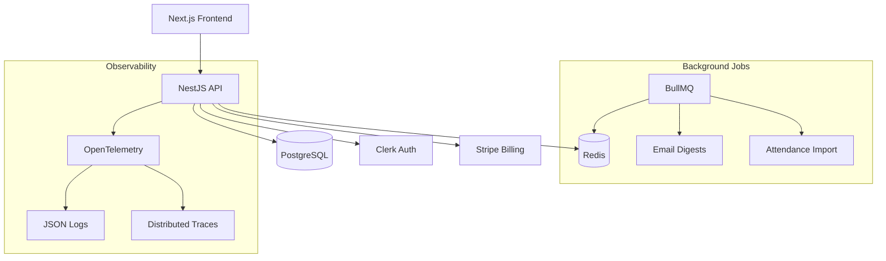

# Jiu-Jitsu Gym SaaS Platform

Multi-tenant SaaS platform for Jiu-Jitsu gyms with member management, attendance tracking, class scheduling, and automated billing.

## Quick Start (5 minutes)

```bash
# Install dependencies
pnpm install

# Start development environment
docker compose up -d

# Run database migrations
pnpm db:migrate

# Seed demo data (1 gym, 1 coach, 3 students)
pnpm db:seed

# Start development servers
pnpm dev
```

Visit http://localhost:3000 to access the platform.

## Architecture



## Tech Stack

- **Frontend**: Next.js 14, Tailwind CSS, TypeScript
- **Backend**: NestJS 10, GraphQL, REST APIs
- **Database**: PostgreSQL 15, Prisma ORM, Redis
- **Authentication**: Clerk (email & social login)
- **Payments**: Stripe Billing with webhooks
- **Background Jobs**: BullMQ
- **Infrastructure**: Docker Compose (dev), AWS Fargate + RDS (prod)
- **Monitoring**: OpenTelemetry, structured logging

## Core Features

### Member Management
- Onboarding workflows with profile setup
- Belt and stripe progression tracking
- Student profile management

### Scheduling & Attendance
- Class scheduling interface
- Check-in kiosk for attendance
- Automated attendance tracking

### Billing & Subscriptions
- Tiered pricing: Starter ($49), Pro ($99), Elite ($199+)
- Automated Stripe billing with overage charges
- Subscription management dashboard

### Multi-Tenancy
- Full tenant isolation with row-level security
- Gym-specific branding and configuration
- GDPR-compliant data handling

## Pricing Tiers

| Tier | Active Students | Monthly Price | Overage |
|------|----------------|---------------|---------|
| Starter | Up to 30 | $49/mo | N/A |
| Pro | Up to 100 | $99/mo | N/A |
| Elite | Unlimited | $199/mo | $0.50 per student over 150 |

## Development

### Prerequisites
- Node.js 18+
- pnpm 8+
- Docker & Docker Compose
- PostgreSQL (via Docker)

### Environment Setup

```bash
# Copy environment template
cp .env.example .env

# Configure required environment variables:
# - CLERK_SECRET_KEY
# - STRIPE_SECRET_KEY
# - DATABASE_URL
# - REDIS_URL
```

### Database Commands

```bash
# Generate Prisma client
pnpm db:generate

# Run migrations
pnpm db:migrate

# Reset database
pnpm db:reset

# Seed demo data
pnpm db:seed
```

### Testing

```bash
# Run all tests
pnpm test

# Run tests with coverage
pnpm test:coverage

# Run E2E tests
pnpm test:e2e
```

### Linting & Formatting

```bash
# Lint all packages
pnpm lint

# Fix linting issues
pnpm lint:fix

# Format code
pnpm format
```

## Deployment to Production

### AWS Infrastructure

```bash
# Initialize Terraform
cd infrastructure
terraform init

# Plan deployment
terraform plan

# Deploy to AWS
terraform apply

# Configure GitHub Actions secrets:
# - AWS_ACCESS_KEY_ID
# - AWS_SECRET_ACCESS_KEY
# - CLERK_SECRET_KEY
# - STRIPE_SECRET_KEY
```

### CI/CD Pipeline

Push to `main` branch triggers automatic deployment:
1. Run tests and linting
2. Build Docker images
3. Deploy to AWS Fargate
4. Run database migrations
5. Health checks and rollback on failure

## Performance Targets

- **Response Time**: P99 read operations < 500ms
- **Scalability**: Support 100+ gyms concurrently
- **Cost Efficiency**: Base infrastructure ≤ $50/mo for first 5 gyms

## Security & Compliance

- Row-level security for complete tenant isolation
- GDPR-compliant data model and audit logging
- Encrypted data at rest and in transit
- Regular security updates and vulnerability scanning

## Support

For issues or questions:
- Check the troubleshooting guide
- Review API documentation at `/docs`
- Contact support: support@jiujitsusaas.com

## License

Proprietary - All rights reserved